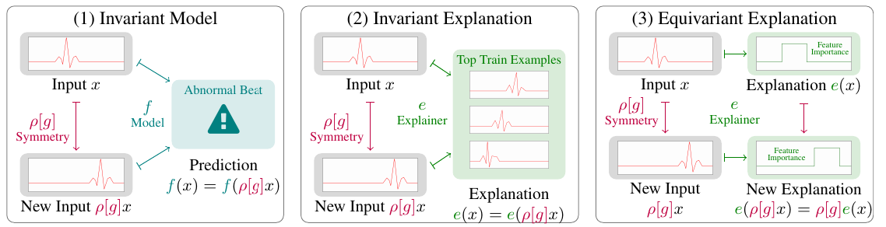

# Explanation Invariance and Equivariance



Code Author: Jonathan Crabbé ([jc2133@cam.ac.uk](mailto:jc2133@cam.ac.uk))

This repository contains the implementation of the explanation invariance and equivariance metrics, a framework to evaluate the robustness of interpretability methods.
For more details, please read our [paper](https://arxiv.org/abs/2304.06715): 'Evaluating the Robustness of Interpretability Methods through Explanation Invariance and Equivariance'.

# 1. Installation


From repository:
1. Clone the repository.
2. [Install Fortran](https://fortran-lang.org/en/learn/os_setup/install_gfortran/) on your machines (this is a prerequisite for the `py3nj` package).
3. Install the required packages from the `environment.yml` file with conda.

```shell
conda env create -f environment.yml
```
4. Activate the created environment.
```shell
conda activate robustxai
```

When the packages are installed, you are ready to evaluate interpretability methods!

# 2. Toy example

Bellow, you can find a toy demonstration where we evaluate the explanation equivariance score for Integrated Gradients explanations of a Fashion-MNIST classifier. The relevant code can be found in the folder
[interpretability](interpretability).

```python
import torch
from torch.utils.data import DataLoader
from torchvision.datasets import FashionMNIST
from torchvision.transforms import transforms
from models.images import AllCNN
from pathlib import Path
from utils.misc import set_random_seed
from captum.attr import IntegratedGradients
from utils.symmetries import Translation2D
from interpretability.robustness import explanation_equivariance_exact
from interpretability.feature import FeatureImportance
from torch.utils.data import Subset

device = torch.device("cuda") if torch.cuda.is_available() else torch.device("cpu")
data_dir = Path.cwd()/"datasets/fashion_mnist"
set_random_seed(42)

# Load the data
transform = transforms.Compose(
    [transforms.ToTensor(), transforms.Pad(10)]
)
test_set = FashionMNIST(data_dir, train=False, transform=transform, download=True)
small_test_set = Subset(test_set, torch.randperm(len(test_set))[:10])
test_loader = DataLoader(small_test_set, batch_size=10, shuffle=False)

# Load the model
model = AllCNN(latent_dim=50)
model.to(device).eval()

# Define symmetry group
translation = Translation2D(max_dispacement=5)

# Define interpretability method
interpretability_method = FeatureImportance(IntegratedGradients(model))

# Compute equivariance score
explanation_equiv = explanation_equivariance_exact(
        interpretability_method, translation, test_loader, device
    ).mean().item()
print(f'{explanation_equiv=:.2f}')
```


# 3. Reproducing the paper results

## 3.A. ECG Dataset
Our script automatically downloads the ECG dataset from Kaggle. To do so, one has
to create a Kaggle token as explained [here](https://towardsdatascience.com/downloading-datasets-from-kaggle-for-your-ml-project-b9120d405ea4).
Once the token is properly set-up, one can run our experiments with the script
```shell
python -m experiments.ecg --name experiment_name --train --plot
```
where the `--train`  option should only be used one time to fit a model for all the experiments.
The `experiment_name` parameter can take the following values:

| experiment_name          | description                                                     |
|--------------------------|-----------------------------------------------------------------|
| feature_importance         | Feature importance equivariance Section 3.1     |
| example_importance | Example importance invariance Section 3.1 |
| concept_importance      | Concept-based invariance Section 3.1   |
| enforce_invariance       | Improving robustness Section 3.2 |
| sensitivity_comparison       | Relaxing invariance Section 3.2 |


The resulting plots and data are saved [here](results/ecg).

## 3.B. Mutagenicity Dataset
One can run our experiments with the script
```shell
python -m experiments.mut --name experiment_name --train --plot
```
where the `--train`  option should only be used one time to fit a model for all the experiments.
The `experiment_name` parameter can take the following values:

| experiment_name          | description                                                     |
|--------------------------|-----------------------------------------------------------------|
| feature_importance         | Feature importance equivariance Section 3.1     |
| example_importance | Example importance invariance Section 3.1 |
| concept_importance      | Concept-based invariance Section 3.1   |

The resulting plots and data are saved [here](results/mut).

## 3.C. ModelNet40 Dataset
Our script automatically downloads the ModelNet40 dataset from Kaggle. To do so, one has
to create a Kaggle token as explained [here](https://towardsdatascience.com/downloading-datasets-from-kaggle-for-your-ml-project-b9120d405ea4).
Once the token is properly set-up, one can run our experiments with the script
```shell
python -m experiments.mnet --name experiment_name --train --plot
```
where the `--train`  option should only be used one time to fit a model for all the experiments.
The `experiment_name` parameter can take the following values:

| experiment_name          | description                                                     |
|--------------------------|-----------------------------------------------------------------|
| feature_importance         | Feature importance equivariance Section 3.1     |
| example_importance | Example importance invariance Section 3.1 |
| concept_importance      | Concept-based invariance Section 3.1   |

The resulting plots and data are saved [here](results/mnet).

## 3.D. FashionMNIST Dataset
One can run our experiments with the script
```shell
python -m experiments.fashion_mnist --name experiment_name --train --plot
```
where the `--train`  option should only be used one time to fit a model for all the experiments.
The `experiment_name` parameter can take the following values:

| experiment_name          | description                                                     |
|--------------------------|-----------------------------------------------------------------|
| feature_importance         | Feature importance equivariance Section 3.1     |
| example_importance | Example importance invariance Section 3.1 |
| concept_importance      | Concept-based invariance Section 3.1   |
| enforce_invariance       | Improving robustness Section 3.2 |


The resulting plots and data are saved [here](results/fashion_mnist).

## 3.E. CIFAR100 Dataset
One can run our experiments with the script
```shell
python -m experiments.cifar100 --name experiment_name --train --plot
```
where the `--train` option should only be used one time to fit a model for all the experiments. If you have [WandB](https://wandb.ai/site) set-up, you can also use the `--use_wandb` option to log the results to your WandB account.
The `experiment_name` parameter can take the following values:

| experiment_name          | description                                                     |
|--------------------------|-----------------------------------------------------------------|
| feature_importance         | Feature importance equivariance Section 3.3     |
| example_importance | Example importance invariance Section 3.3 |
| concept_importance      | Concept-based invariance Section 3.3   |

## 3.F. STL10 Dataset
One can run our experiments with the script
```shell
python -m experiments.stl10 --name experiment_name --train --plot
```
where the `--train` option should only be used one time to fit a model for all the experiments. If you have [WandB](https://wandb.ai/site) set-up, you can also use the `--use_wandb` option to log the results to your WandB account.
The `experiment_name` parameter can take the following values:

| experiment_name          | description                                                     |
|--------------------------|-----------------------------------------------------------------|
| feature_importance         | Feature importance equivariance Section 3.3     |
| example_importance | Example importance invariance Section 3.3 |
| concept_importance      | Concept-based invariance Section 3.3   |

The resulting plots and data are saved [here](results/stl10).

## 3.G. Failure Modes
To visualize failure modes of various interpretability methods, one can use the Jupyter notebook [here](explanations_fail.ipynb). Note that this assumes that models have been trained for the FashionMNIST and the STL10 datasets. All the parameters from this notebook can be adapted to explore more failure modes.

# 4. Citing

If you use this code, please cite the associated paper:

```
@misc{crabbé2023evaluating,
      title={Evaluating the Robustness of Interpretability Methods through Explanation Invariance and Equivariance}, 
      author={Jonathan Crabbé and Mihaela van der Schaar},
      year={2023},
      eprint={2304.06715},
      archivePrefix={arXiv},
      primaryClass={cs.LG}
}
```
 
